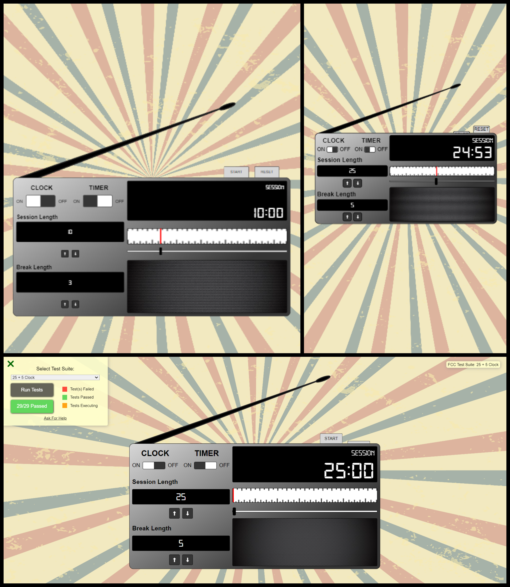

# Front End Development Libraries Project 5 - FreeCodeCamp

This is a 25 + 5 Clock (mostly a timer actually). It’s part of the required projects to complete FreeCodeCamp’s Front End Development Libraries certification.

## Table of contents

- [Overview](#overview)
  - [The challenge](#the-challenge)
  - [Screenshot](#screenshot)
  - [Links](#links)
- [My process](#my-process)
  - [Built with](#built-with)
  - [What I learned](#what-i-learned)
  - [Continued development](#continued-development)
  - [Useful resources](#useful-resources)
- [Author](#author)

## Overview

### The challenge

The goal is to build an app that is functionally similar to the [25 + 5 Clock](https://clock.freecodecamp.rocks/) given as an example.

All the tests passed (after turning on the timer, obviously)!

The exact requirements:

1. There is an element with `id="break-label"` that contains a string (e.g. "Break Length").
2. There is an element with `id="session-label"` that contains a string (e.g. "Session Length").
3. There are two clickable elements with corresponding IDs: `id="break-decrement"` and `id="session-decrement"`.
4. There are two clickable elements with corresponding IDs: `id="break-increment"` and `id="session-increment"`.
5. There is an element with a corresponding `id="break-length"`, which by default (on load) displays a value of 5.
6. There is an element with a corresponding `id="session-length"`, which by default displays a value of 25.
7. There is an element with a corresponding `id="timer-label"`, that contains a string indicating a session is initialized (e.g. "Session").
8. There is an element with corresponding `id="time-left"`. NOTE: Paused or running, the value in this field should always be displayed in `mm:ss` format (i.e. 25:00).
9. There is a clickable element with a corresponding `id="start_stop"`.
10. There is a clickable element with a corresponding `id="reset"`.
11. When the element with the id of `reset` is clicked, any running timer should be stopped, the value within `id="break-length"` should return to `5`, the value within `id="session-length"` should return to 25, and the element with `id="time-left"` should reset to its default state.
12. When the element with the id of `break-decrement` is clicked, the value within `id="break-length"` decrements by a value of 1, and I can see the updated value.
13. When the element with the id of `break-increment` is clicked, the value within `id="break-length"` increments by a value of 1, and I can see the updated value.
14. When the element with the id of `session-decrement` is clicked, the value within `id="session-length"` decrements by a value of 1, and I can see the updated value.
15. When the element with the id of `session-increment` is clicked, the value within `id="session-length"` increments by a value of 1, and I can see the updated value.
16. It's not allowed to set a session or break length to <= 0.
17. It's not allowed to set a session or break length to > 60.
18. When the element with `id="start_stop"` is first clicked, the timer should begin running from the value currently displayed in `id="session-length"`, even if the value has been incremented or decremented from the original value of 25.
19. If the timer is running, the element with the id of `time-left` should display the remaining time in `mm:ss` format (decrementing by a value of 1 and updating the display every 1000ms).
20. If the timer is running and the element with `id="start_stop"` is clicked, the countdown should pause.
21. If the timer is paused and the element with `id="start_stop"` is clicked, the countdown should resume running from the point at which it was paused.
22. When a session countdown reaches zero (NOTE: timer MUST reach 00:00), and a new countdown begins, the element with the id of `timer-label` should display a string indicating a break has begun.
23. When a session countdown reaches zero (NOTE: timer MUST reach 00:00), a new break countdown should begin, counting down from the value currently displayed in the `id="break-length"` element.
24. When a break countdown reaches zero (NOTE: timer MUST reach 00:00), and a new countdown begins, the element with the id of `timer-label` should display a string indicating a session has begun.
25. When a break countdown reaches zero (NOTE: timer MUST reach 00:00), a new session countdown should begin, counting down from the value currently displayed in the `id="session-length"` element.
26. When a countdown reaches zero (NOTE: timer MUST reach 00:00), a sound indicating that time is up should play. This should utilize an HTML5 `audio` tag and have a corresponding `id="beep"`.
27. The audio element with `id="beep"` must be 1 second or longer.
28. The audio element with id of `beep` must stop playing and be rewound to the beginning when the element with the id of `reset` is clicked.

### Screenshot



### Links

- Challenge URL: [Challenge URL](https://www.freecodecamp.org/learn/front-end-development-libraries/front-end-development-libraries-projects/build-a-25--5-clock)
- Live Site URL: [Live site URL](https://leo-code-ca.github.io/25-5-Clock/)

## My process

### Built with

- React
- BEM methodology
- Sass

### What I learned

I can barely believe it! That's it, I'm about to complete my third FreeCodeCamp's certification! This one definitely took me a little while to finish as I was also working on other projects and keep improving my JavaScript skills in parallel. This last project was actually quite challenging to be honest! 

For whatever reason, I struggled a lot when I had to choose the different states I wanted to create for my app, while keeping it as minimal as possible as recommended. First, I tried to implement one single state managing both the session timer and the break timer. I wasn't able to achieve what I wanted that way so I decided to try to divide this state in two: one for the session timer and one for the break one. I managed to make it work that way but I still feel like it could have been done a better way.

Then, about the timer itself, it was kind of tough to find a way to display it as required (mm:ss format). What made me struggle the most is probably to find a way to differentiate both timers and to make them run one after the other repeatedly. From what I understood, as I was updating my state inside my interval function and trying to read it at the same place, I wasn't able to access the latest value of the ongoing property of my state so I couldn't use it to know which timer was next. 

I used the `useEffect` hook for the first time since I read all the documentation about it, it worked pretty well to create my real time clock. I also used (a lot!) the `useRef` hook which definitely proved me its utility in that project. I hesitated to create reducers to manage my timer states but I thought it wasn't needed. Now, I think it would actually have been easier.  
```
useEffect(() => {

       if (clockOn) {

          clockIntervalID.current = setInterval(() => {

             const date = new Date();
             let hours = date.getHours();
             let minutes = date.getMinutes();
             let seconds = date.getSeconds();

             switch (hours) {
                 case 13:
                     hours = "01";
                 break;                        
                 case 14:
                     hours = "02";
                     break;
                 case 15:
                     hours = "03"
                     break;
                 case 16:
                     hours = "04";
                     break;
                 case 17:
                     hours = "05";
                     break;
                 case 18:
                     hours = "06";
                     break;
                 case 19:
                     hours = "07";
                     break;
                 case 20:
                     hours = "08";
                     break;
                 case 21:
                     hours = "09";
                     break;
                 case 22:
                     hours = "10";
                     break;
                 case 23:
                     hours = "11";
                     break;
                 case 24:
                     hours = "00";
                     break;
                 default:
                    hours = hours;
             }
                
             hours.toString().length === 1 ? hours = "0" + hours : null;
             minutes.toString().length === 1 ? minutes = "0" + minutes : null;
             seconds.toString().length === 1 ? seconds = "0" + seconds : null;

             setTime(`${hours}:${minutes}${seconds}`);
                
         }, 1000);

     }
        
     return () => clearInterval(clockIntervalID.current);

}, [clockOn]);
```
Let's summarize what I've learned:

 - Use the `useEffect` hook for a real time clock
 - Use the `useRef` hook to reference values and manipulate the DOM
 - Build a timer from scratch that the user can play and pause on-demand 
 - Use Font Awesome with React
 - Create a slider with a cursor that the user can move horizontally only
 - Create animations with the Animation web API
 - Handle mobile events with `touchstart` , `touchmove` and `touchend` 

### Continued development

Lately, I spent lots of time on the react documentation to try to understand the hooks in depth. I felt frustrated when I realized that even after acquiring that knowledge I was still struggling with things that didn't look that challenging to me. It probably means I need more practice, that's why I'm extremely motivated to build more apps with React, even if I'm done with this front-end development libraries certifications. 

I also feel like I still have a lot to learn about Vanilla JS itself and all the amazing API's built around it. Even if I plan to start diving into the backend asap, I'll still take some time to keep improving my frontend skills. 

Lately, I discovered that my responsiveness management was actually kind of poor! I only recently truly realized the struggle it was! With the media breakpoints based on the viewport width, it's not too hard to obtain something that looks decent. However, when I started to take into account the orientation of the device (portrait and landscape), I discovered a totally new problem! I've been working on that but I'm not handling it quite well yet!

To conclude, I just would like to take a step back and realize how far I've come in my development journey. It's been about 6 months I started coding and I'm definitely happy of what I managed to build so far, when I had absolutely no previous knowledge about programing at all not so long ago. The more the time passes, the more I appreciate coding and that's amazing. I can't wait to discover what's to come next!  

### Useful resources

- [Draggable cursor](https://javascript.info/mouse-drag-and-drop) - This article saved me! I was totally clueless about how to implement my horizontally only draggable cursor and the explanations they provide have been really helpful! 
- [useRef documentation](https://react.dev/reference/react/useRef) - As usual, I can't emphasize enough how much I appreciate the react docs! It's done in a really understandable way and the exercises they offer at the end of most of their articles are excellent. 
- [Mobile events](https://www.w3schools.com/jsref/event_touchstart.asp) - When I was working on the responsiveness of my app, I realized that my draggable cursor wasn't working on mobile devices! That's when I learned there are specifics events to handle mobile touch! It's now fixed!

## Author

- GitHub - [@Leo-Code-CA](https://github.com/Leo-Code-CA)
- FreeCodeCamp - [@Leo-code](https://www.freecodecamp.org/Leo-code)